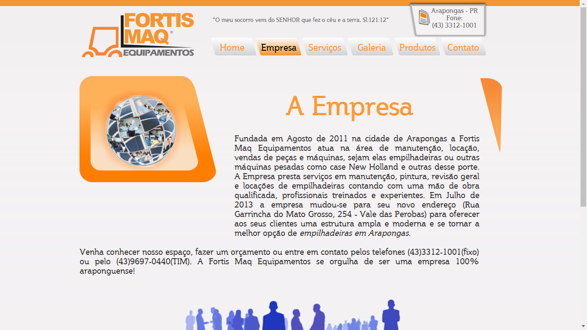
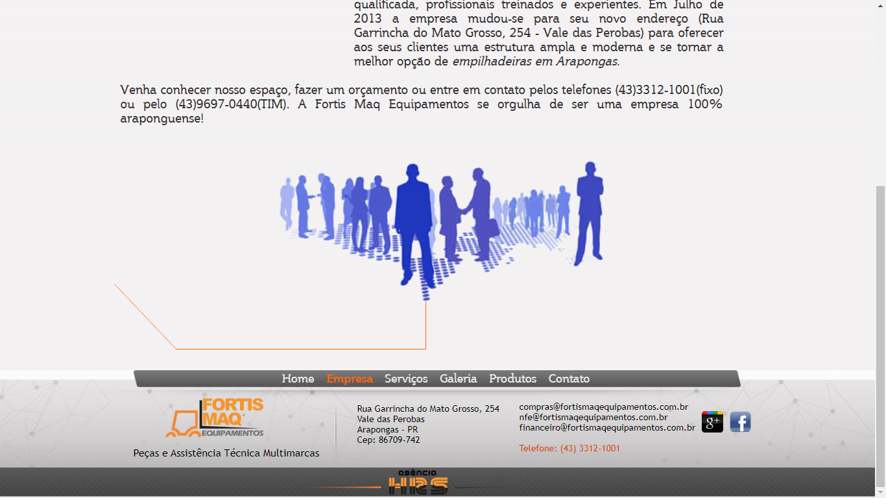
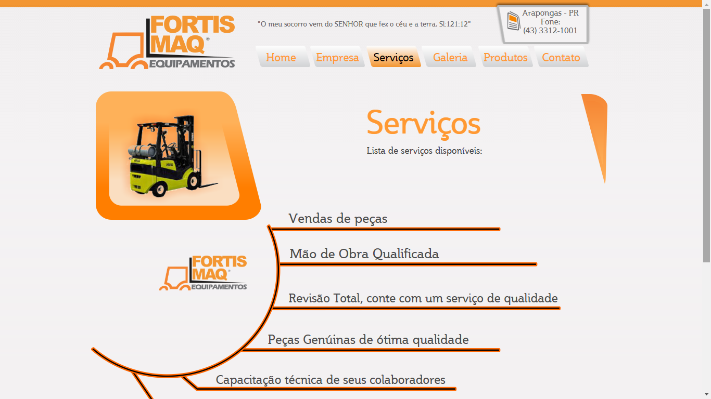
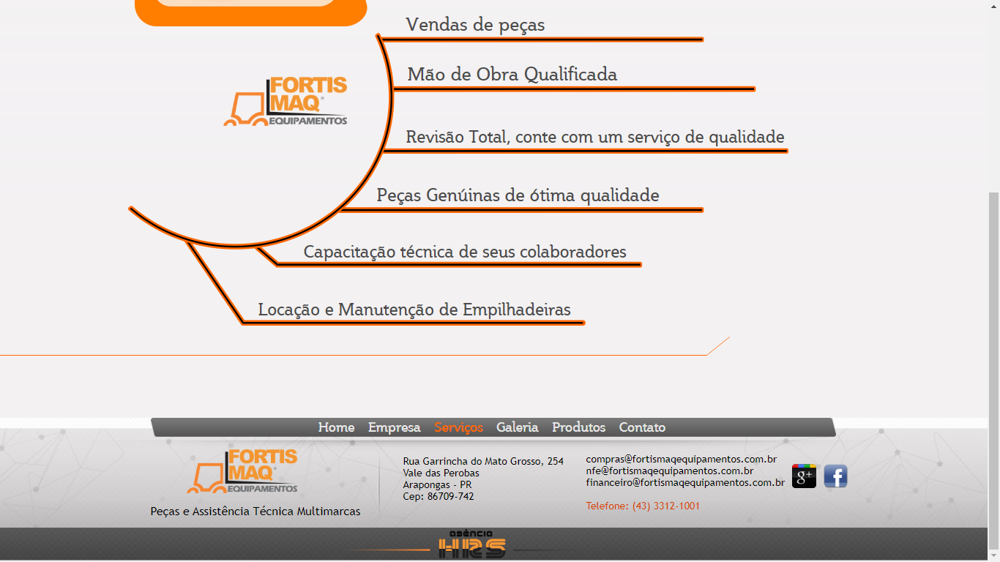
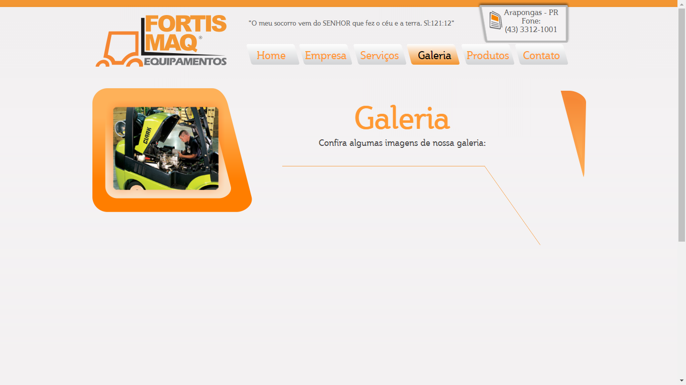
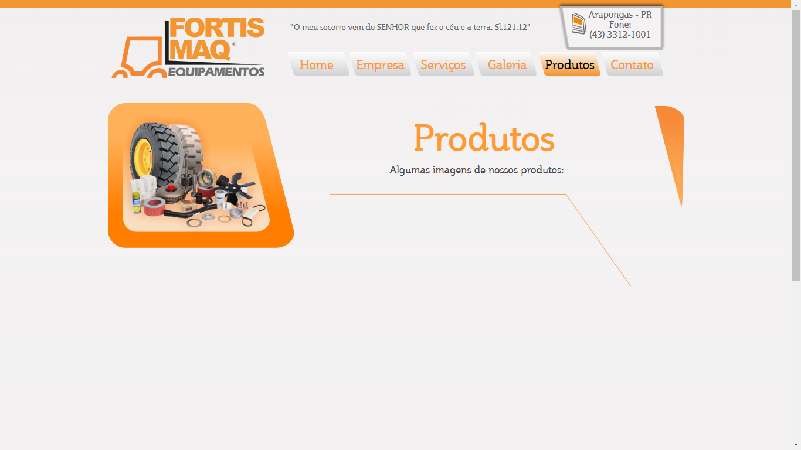
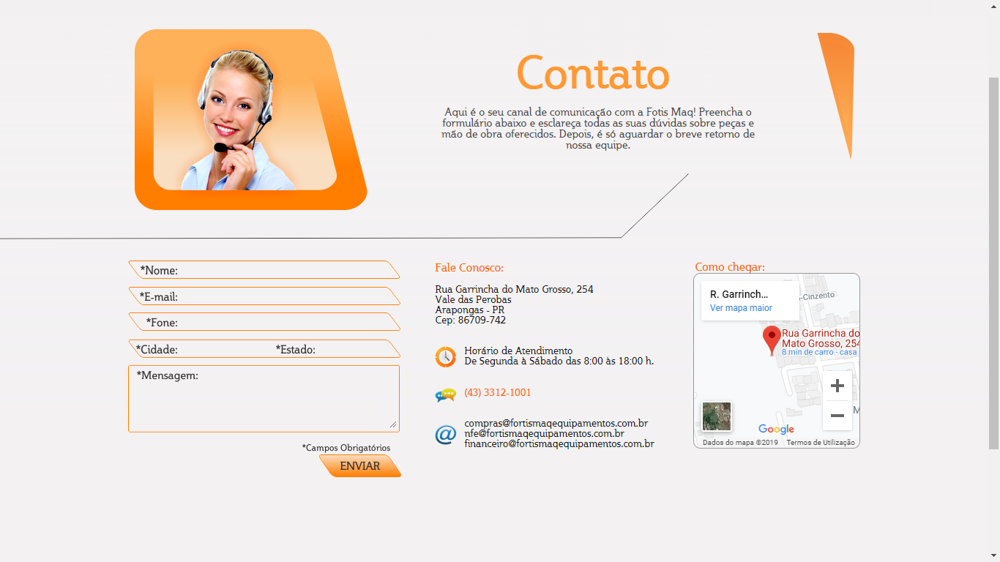
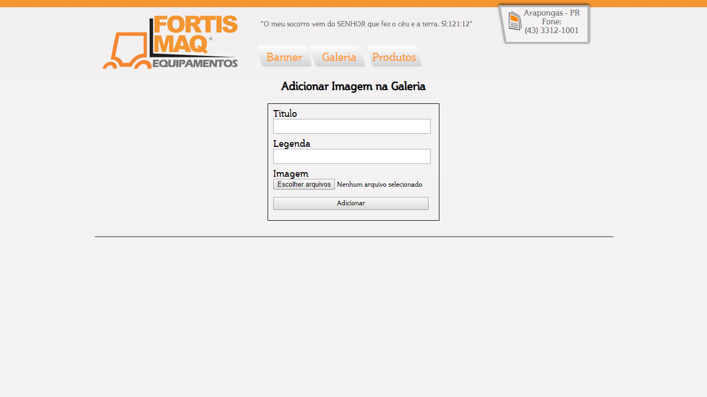
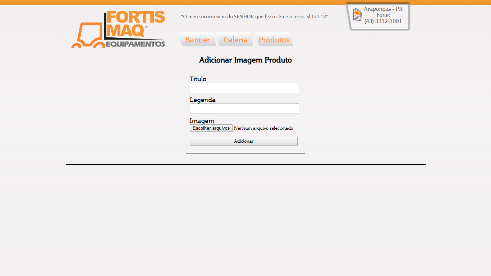

# Site-de-Maquinas
Site desenvolvido em meado de 2012 trabalhando profissionalmente

Site feita para uma empresa de aluguel de empilhadeiras, com Painel administrativo para o admin cadastrar banenrs, galeria, etc. Programado por mim desde o front-end ao back-end em PHP, onde foi de extrema importância o meu aprendizado. De forma estrutural onde tentava sempre inovar da minha maneira, hoje em dia claro que não é uma boa prática o metodo e a maneira como foi programado, mas na época foi muito importânte para mim testar novos conhecimentos e o mais importante, ajuando o usuário final.

# Configuração
A pasta SQL BANDO DE DADOS contém o arquivo .sql do banco de dados (Mysql).
Altere o arquivo connect.php que está dentro da pasta fortismaqadmin
Para se logar altere as credenciais do arquivo authorize.php que esta dentro da pasta fortismaqadmin

          
